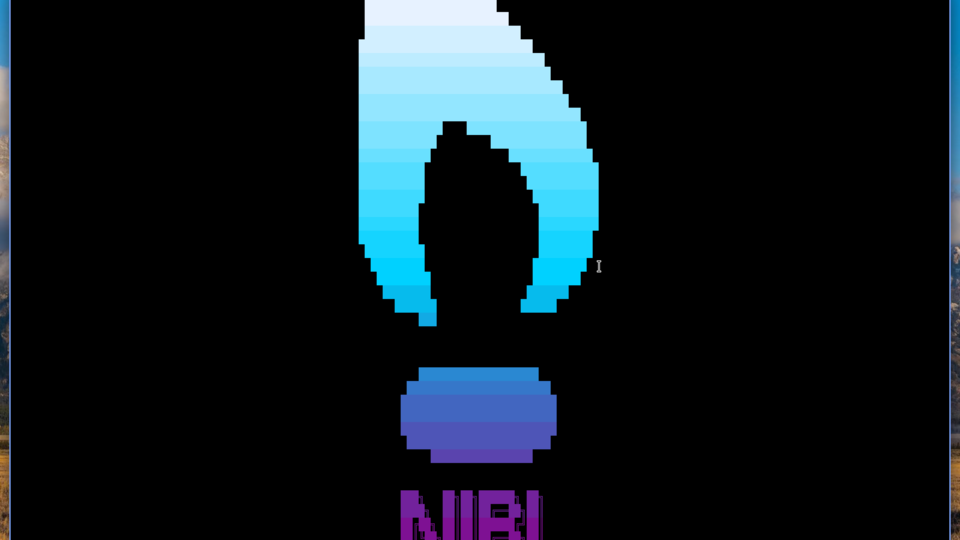

# Niri Screensaver

Idle-aware terminal screensaver for [niri](https://github.com/YaLTeR/niri),
driven by [TerminalTextEffects](https://github.com/ChrisBuilds/terminaltexteffects)
and rendered in a fullscreen Alacritty surface.



## What this plugin does

- **Auto-registers a screensaver entry** in Noctalia's
  `Settings.data.idle.customCommands` based on an Enabled toggle, so the
  screensaver kicks in after your configured idle threshold without manual
  JSON edits.
- **Auto-wires the screenLock / screenUnlock hook slots** so the screensaver
  tears down cleanly when Noctalia's lock fires (avoids burning CPU under the
  lock surface). Only writes to hook slots that are empty or already hold the
  plugin's command — never clobbers a hook you authored manually.
- **Bar widget**: click to trigger; right-click for stop / toggle enabled /
  open settings. Recolors to follow the active Noctalia theme.
- **Settings tab** for idle threshold, effect include/exclude lists,
  fade-in/out **dropdowns** populated from `niri-screensaver-ctl effects`,
  a **logo file dropdown** that auto-refreshes from your logo directory,
  a **folder picker** for the logo directory itself, plus clock, now-
  playing, and a manual trigger/stop pair.
- **IPC surface** `plugin:niri-screensaver` exposing `launch`, `kill`,
  `toggle` — bind to niri keybinds via
  `qs ipc call plugin:niri-screensaver launch`.
- **Writes settings** to `~/.config/niri-screensaver/config` (XDG-aware) in
  shell `KEY="value"` format — the same file the bash CLI reads. The plugin
  and the CLI stay in lockstep.

## Requires the bash CLI

This plugin **does not ship** the actual screensaver. It expects
`niri-screensaver-launch` on `$PATH`. Install it first from
<https://github.com/jfreed-dev/niri-screensaver>:

```bash
git clone https://github.com/jfreed-dev/niri-screensaver
cd niri-screensaver
./install.sh                 # → ~/.local/bin
```

Also requires `alacritty` and the `tte` Python CLI on PATH (`pip install
--user terminaltexteffects`). If the CLI is missing the plugin surfaces a
banner at the top of its settings panel.

## Compositor support

niri-specific. The launcher enumerates outputs via `niri msg --json outputs`
and relies on niri's window-rule on `app-id="niri-screensaver"` for
fullscreen. Won't work on Hyprland / Sway / labwc without porting.

## Settings

Each field in the plugin's Settings tab maps to a key in the shell-format
config the bash CLI reads. Changing a value writes the file on save and
re-syncs the idle hook.

| UI label | Widget | Shell key | Default |
|---|---|---|---|
| Enabled | toggle | (idle customCommands entry) | `true` |
| Idle threshold (seconds) | spinbox | customCommand `timeout` | `300` |
| Skip on battery below (%) | spinbox | `BATTERY_MIN_PERCENT` | `0` |
| Logo file | dropdown | `LOGO_FILE` | _empty_ |
| Random logo per cycle | toggle | `RANDOM_LOGO` | `false` |
| Logo directory | text + Browse | `LOGO_DIR` | _empty_ |
| Include effects (CSV) | text | `INCLUDE_EFFECTS` | _empty_ |
| Exclude effects (CSV) | text | `EXCLUDE_EFFECTS` | `dev_worm` |
| Fade-in effect | dropdown | `FADE_IN_EFFECT` | _empty_ |
| Fade-out effect | dropdown | `FADE_OUT_EFFECT` | _empty_ |
| Show clock between effects | toggle | `SHOW_CLOCK` | `false` |
| Clock format (strftime) | text | `CLOCK_FORMAT` | `%H:%M` |
| Show now-playing track | toggle | `SHOW_NOW_PLAYING` | `false` |
| Now-playing duration (s) | spinbox | `NOW_PLAYING_DURATION` | `3` |
| Trigger now | button | (runs `launcherCommand`) | `niri-screensaver-launch launch` |
| Stop | button | (runs `killCommand`) | `niri-screensaver-launch kill` |

The "Logo file" and fade-effect dropdowns are populated at runtime:
the logo list watches your logo directory (`LOGO_DIR` override or the
installed `share/logos/`) and auto-refreshes when files appear or
disappear; the fade lists come from `niri-screensaver-ctl effects`.

Settings not surfaced in the UI (`FRAME_RATE`, `CLOCK_DURATION`,
`CLOCK_FONT`, `CURSOR_HIDE`, `DISMISS_ON_KEY`) can be edited directly in
`~/.config/niri-screensaver/config` — they round-trip through the plugin on
next reload.

## Logos

The "Logo file" dropdown lists every `.txt` in your active logo
directory and auto-refreshes when files appear or disappear — no
Noctalia reload needed. The list is built from:

1. The `LOGO_DIR` override if you set one (use the Browse button next
   to "Logo directory" to pick it visually).
2. Otherwise the installed system path: `/usr/share/niri-screensaver/logos/`
   (AUR install) or `~/.local/share/niri-screensaver/logos/` (running
   `./install.sh` from the repo).

The first option in the dropdown ("Default") clears the explicit logo
path so the bash driver re-applies its built-in seed
(`niri-name-with-icon.txt`).

### Creating your own

Drop a UTF-8 `.txt` file into your logo directory and it'll show up
in the dropdown the next time the panel renders. Short version:

- **Size:** keep within ~40–60 columns wide so it doesn't wrap on
  narrow terminals; height is forgiving.
- **Layout:** TTE centers the entire file as one bounding box. Trailing
  whitespace on lines shifts the visual center off — strip it. Blank
  lines at top/bottom add vertical padding.
- **Characters:** block elements (`█ ▓ ▒ ░`) and box-drawing render
  cleanest across monospace fonts; ANSI Shadow wordmarks (try
  `figlet -f "ANSI Shadow"` or [patorjk.com/software/taag/](https://patorjk.com/software/taag/))
  look polished out of the box.
- **Preview** before committing:

  ```bash
  LOGO_FILE=~/Downloads/mylogo.txt niri-screensaver-ctl test
  ```

Full guide with image-to-ASCII recipes (`jp2a`, `chafa`), font sources,
and a sizing reference table:
[Creating your own](https://github.com/jfreed-dev/niri-screensaver#creating-your-own)
in the upstream README.

## License

GPL-3.0-only. See [LICENSE](https://github.com/jfreed-dev/niri-screensaver/blob/main/LICENSE)
in the upstream repo.
