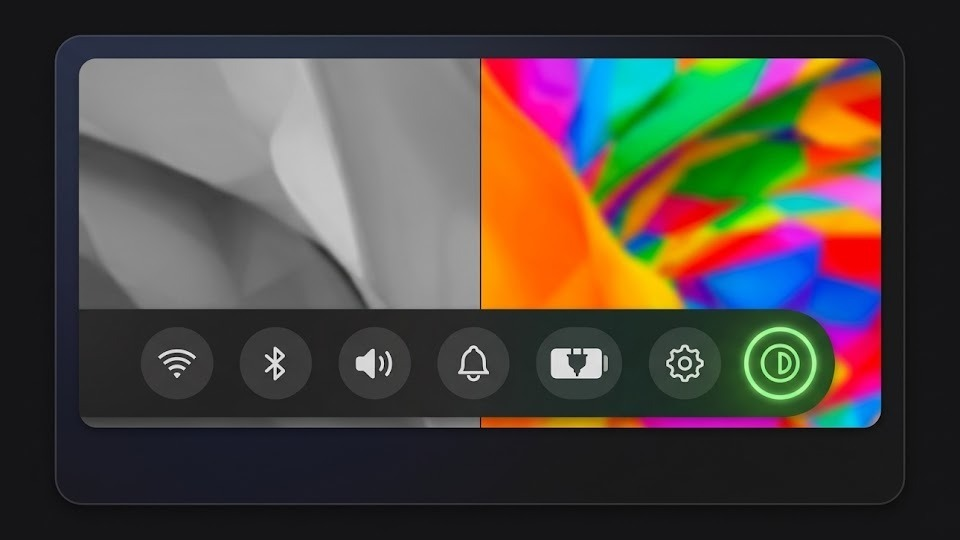

# NVibrant

A Noctalia plugin to toggle **NVIDIA digital vibrance** (color saturation) directly from the bar — no terminal needed.



## Features

- One-click toggle in the bar — icon highlights when vibrance is active
- Configurable vibrance level (0–1023)
- Multi-monitor support
- State persists across restarts
- Right-click context menu with quick enable/disable

## Requirements

- [nvibrant](https://github.com/Tremeschin/nvibrant) installed (`yay -S nvibrant-bin`)
- NVIDIA GPU with display connected directly to it (not via iGPU/hybrid graphics)

> **Hybrid graphics (Optimus) note:** On laptops with hybrid AMD+NVIDIA, the internal display (eDP) is typically routed through the AMD iGPU and is **not** controllable by nvibrant. Switch your BIOS to **Discrete GPU / NVIDIA-only** mode to make the internal display available to nvibrant.

## Installation

Install via the Noctalia plugin manager, or manually:

```bash
git clone https://github.com/noctalia-dev/noctalia-plugins ~/.config/noctalia/plugins/nvibrant
```

*Note: If cloning manually, ensure the `nvibrant` folder is located directly inside your plugins directory.*

Then enable the plugin and add the bar widget in Noctalia Settings.

## Usage

| Action | Result |
|---|---|
| Left click | Toggle vibrance on/off |
| Right click | Context menu (toggle + settings) |
| IPC | `qs -c noctalia-shell ipc call plugin:nvibrant toggle` |

## Settings

| Setting | Default | Description |
|---|---|---|
| Vibrance Level | 512 | Intensity: 0 = default, 1023 = maximum saturation (~200%) |
| Display Count | 1 | Number of displays/ports to apply vibrance to |

## License

MIT
