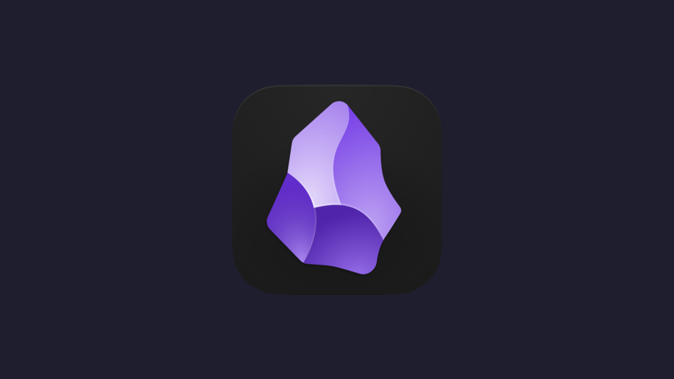

# Obsidian Provider

## A Noctalia launcher provider for quickly switching between Obsidian vaults.

### Preview:

## Features

- Browse and open all your Obsidian vaults from the Noctalia launcher
- Sorted by most recently accessed
- Fuzzy search by vault name
- Badge indicator on vaults currently open in Obsidian
- Optionally include vaults in the global launcher search (without the `>obs` prefix)

## Usage

Type `>obs` in the launcher to list all vaults, then continue typing to fuzzy-filter by name. Select a vault to open it in Obsidian.

Vaults also appear in global search when **Include in main search** is enabled.

## Settings

| Setting | Default | Description |
|---|---|---|
| Obsidian config path | `~/.config/obsidian/obsidian.json` | Path to Obsidian's config file containing the vault list |
| Include in main search | `true` | Show vaults in the global launcher search without the `>obs` prefix |

## Requirements

- [Obsidian](https://obsidian.md) installed (any distribution)
- Noctalia ≥ 4.5.0
