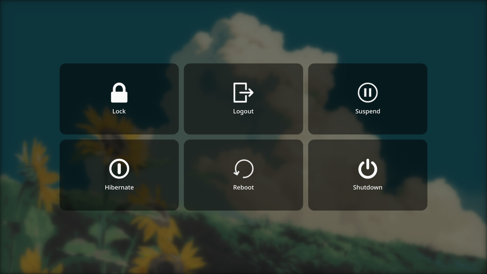

# Somnus Power Menu

A fullscreen power menu, inspired by wlogout. Provides quick access to all system power actions with a clean, animated interface.



## Features

- **Two display modes**: Overlay (fullscreen with wallpaper blur and configurable tint) and Panel (centered window with semitransparent background)
- **Six power actions**: Lock, Logout, Suspend, Hibernate, Reboot, Shutdown
- **Smart suspend**: Optionally lock the session before suspending
- **Staggered animations**: Smooth entry animation per button with configurable toggle
- **Hover effects**: Scale and color change with adjustable desaturation
- **Full keyboard navigation**: Arrow keys, number keys (1–6), Enter, Escape
- **Bar widget**: Left-click toggles the menu, right-click opens settings
- **CLI support**: Toggle via `qs ipc call plugin:somnus toggle`
- **Theme-aware**: The bar button and hover colors automatically adapt to your Noctalia theme — whether it's generated from your wallpaper or a manual theme, light or dark mode.

## Configuration

All settings are available through the Noctalia settings panel. Right-click the bar button and select "Settings", or open it from the shell settings menu.

Buttons are arranged in a 3×2 grid. Number keys map to each position:

```
1 → Lock       2 → Logout      3 → Suspend
4 → Hibernate  5 → Reboot      6 → Shutdown
```

| Setting | Default | Description |
|---|---|---|
| `Icon Color` | `primary` | Color of the bar button icon |
| `Lock on Suspend` | `enabled` | Lock session before suspending |
| `Button Width` | `470 px` | Width of each power button |
| `Button Height` | `280 px` | Height of each power button |
| `Button Spacing` | `20 px` | Gap between buttons in the grid |
| `Button Opacity` | `50%` | Background opacity of idle buttons |
| `Hover Color` | `primary` | Background color on hover/focus |
| `Hover Desaturation` | `0%` | Desaturate the hover color (0–85%) |
| `Display Mode` | `Overlay` | Overlay (fullscreen + blur) or Panel (centered) |
| `Overlay Blur` | `75%` | Background blur intensity in overlay mode |
| `Overlay Tint` | `60%` | Dark tint opacity in overlay mode |
| `Panel Tint` | `70%` | Background opacity in panel mode |
| `Animations` | `enabled` | Toggle all entry and hover animations |

## Keyboard Shortcuts

| Key | Action |
|---|---|
| `Arrow keys` | Move focus between buttons |
| `1–6` | Select and execute action by position |
| `Enter / Space` | Execute focused action |
| `Escape / toggle keybind` | Close the menu |

## Keybind

Add to your compositor config:

### Hyprland (Lua)
```lua
hl.bind("SUPER + X", hl.dsp.exec_cmd("qs -c noctalia-shell ipc call plugin:somnus toggle"))
```

### Hyprland (Config)
```conf
bind = SUPER, X, exec, qs -c noctalia-shell ipc call plugin:somnus toggle
```

## License

MIT

## Credits

- **wlogout** — Interface design inspiration (button grid layout and power actions).
